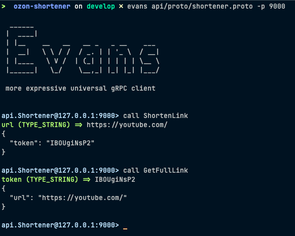

# Ozon url-shortener

## Description

### Сервис по сокращению ссылок. Тестовое задание для Ozon Fintech.

Реализована трех-уровневая архитектура: `handler` -> `service` -> `storage`.  
Service - слой бизнес-логики.

В качестве веб-фреймворка решил использовать `echo`. Наверное для этой задачи стоило выбрать `fasthttp`,
но мне интересно было попробовать `echo`. В своих же проектах чаще отдаю предпочтение `chi`.

В работе с Postgres использовал библиотеку `jackc/pgx` и как драйвер и как интерфейс.  
Протестировал слои хэндлеров и бизнес-логики с помощью `testify` и `gomock`.

В задании, при описании эндпоинтов, было описание метода Get: 'будет принимать сокращённый URL и возвращать оригинальный'.
И либо я понял все правильно, либо зашел немного дальше и реализовал перенаправление с 
http-кодом `301 Moved Permanently`.

Надо заметить, что в случае, когда нужно будет собрать
статистику по переходам или будет реализован функционал редактирования уже сокращенной ссылки, 
я бы использовал http-код `302 Found`. А с кодом `301` браузер клиента запоминает куда нужно 
переходить и в следующий раз не нагружает наш сервис.


## Project Structure
```
ozon-shortener
│
├── api/
│   └── proto           - Прото-файлы
├── cmd/
│   └── shortener       - Входная точка
├── internal/
│   ├── config          - Конфигурация запуска
│   ├── customErrors    - Кастомные ошибки
│   ├── handlers/
│   │   ├── grpc        - gRPC хэндлеры
│   │   └── http        - http хэндлеры
│   ├── interfaces      - Используемые интерфейсы
│   ├── logger          - Конфигурация логера
│   ├── mock            - Моки для тестирования
│   ├── models          - Используемые структуры
│   ├── server          - Запуск сервера и роутер
│   ├── service         - Слой бизнес-логики
│   └── storage/        
│       ├── memory      - Слой работы памятью
│       └── postgres    - Слой работы с Postgres
└── pkg/
    └── api             - Сгенерированные .pb.go файлы
```

## Endpoints

### http Endpoints

У сервиса есть два http эндпоинта:

- `POST /api/shorten`
    - Хэндлер для сокращения новой ссылки
    - Принимает JSON со ссылкой, которую хотим сократить
    - Возвращает сокращенный вариант также в JSON:

```json
{
  "link": "http://localhost:8000/THIou2QF57"
}
```

- `GET /:id`
  - Хэндлер для перехода по изначальной ссылке
  - Отдает ссылку в хедере `Location` с http-кодом `301 Moved Permanently`
  - Если ссылки не существует, возвращает http-код `204 No content`

### gRPC Endpoints

Так же продублировал функционал и gRPC эндпоинтами, тестировал утилитой Evans:


## Deploy

Все параметры сервиса и базы данных берутся из переменных окружения.  
Окружение задается файлом [.env](.env).

Собрать и запустить контейнеры с сервисом и с базой данных можно командами:
```sh 
$ make build
$ make compose
```

Также есть возможность собрать и запустить контейнер с сервисом, 
работать будет с in-memory хранилищем:
```sh 
$ make build_memory
$ make run_memory
```

Для того чтобы запустить приложение не используя Docker, можно просто запустить приложение с флагом:
```sh
$ go run cmd/main.go -h <http-port> -g <gRPC-port> -d <database_uri>
```
- Без флага `-h` http-сервер запустится на порте `:8000`.
- Без флага `-g` gRPC-сервер запустится на порте `:9000`.
- Флаг `-d` задает путь до базы Postgres.
- Флаг `-m` запускает приложение с in-memory хранилищем.

Все эти параметры также можно задать через переменные окружения

Запуск тестов:
```sh
$ make test
```